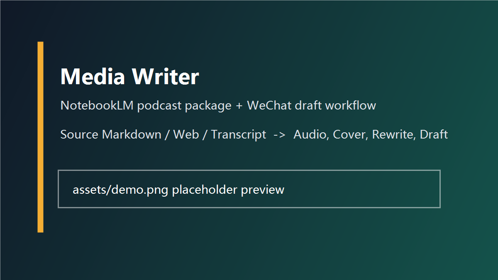

<div align="center">

# 🎙️ Media Writer

**多源内容智能处理器：任意内容 → 内容诊断 / 低创作度避坑 / NotebookLM 播客包 / PPT 设计稿 / PPT+播客动态视频 / 微信公众号草稿 / 小红书科普帖**

把文章、剪藏、网页、播客转录稿或长文资料，先做内容价值与传播价值诊断，再做低创作度和平台分发风险避坑检查，然后整理成可交付的播客音频包、PPT 设计提示词/幻灯片稿、PPT+播客动态视频，并按媒体写作逻辑改写成微信公众号草稿或小红书发布稿。


[快速开始](#-快速开始) ·
[支持格式](#-支持格式) ·
[使用示例](#-使用示例) ·
[配置说明](#-配置说明) ·
[常见问题](#-常见问题)

</div>

---

## 📌 项目简介

Media Writer 是一个面向 Codex / Agent 工作流的本地 Skill 仓库。它把常见但容易割裂的媒体生产动作拆成多个可独立触发的分支：

- **内容诊断分支**：在生成前判断内容价值、传播价值、认知落差、平台适配和播客策略，输出 Markdown/JSON 诊断文件作为后续分支依据。
- **低创作度/限流避坑分支**：在正式生成前检查同质化、搬运洗稿、低信息量、低价值 AIGC、私域诱导、敏感题和盗图风险，输出 Markdown/JSON 质量闸门文件。
- **播客分支**：读取任意可用资料，上传或添加到 NotebookLM，生成中文播客音频，并产出标题、简介和封面。
- **PPT 分支**：读取原始内容，先做内容理解、叙事结构和视觉决策，再输出中英双语图像提示词和可渲染的幻灯片稿。
- **PPT+播客视频分支**：使用已生成或用户提供的 PPT/幻灯片图片和播客音频，生成带字幕、关键词强调和强叙事动态效果的 16:9 MP4。
- **微信公众号草稿分支**：读取原始内容，先做结构分析和选题拆解，再改写为新的中文公众号文章，转换为 WeChat HTML，上传封面并创建微信公众平台草稿。
- **小红书分支**：读取并分析原始内容，默认改写成小红书科普帖，生成标题候选、解释型正文、热门相关标签和封面建议。

这不是一个“把原文复制到公众号”的脚本，而是一个用于内容再创作、媒体包装和多渠道交付的 Agent Skill。

## 🤔 为什么需要这个项目

内容创作者经常会遇到三个问题：

1. 好内容分散在 Markdown、网页、X/Twitter、播客转录稿和笔记工具里。
2. 播客生成、封面制作、标题简介、公众号排版和草稿上传分别依赖不同工具。
3. 直接转换会保留太多原文痕迹，不适合公众号这类需要重新开题、重写开头和重构节奏的平台。

Media Writer 的目标是把这些步骤组织成一个稳定流程：**先理解内容，再按媒体平台重新写作，最后产出可以直接检查和发布的交付物**。

## ✨ 核心功能

1. **内容诊断**：生成 `*_content_diagnosis.md` 和 `*_content_diagnosis.json`，区分内容价值、传播价值、五维诊断、平台策略和播客策略。
2. **平台质量闸门**：生成 `*_platform_quality_guardrail.md` 和 `*_platform_quality_guardrail.json`，将低创作度、限流、低价值 AIGC、洗稿、私域诱导和素材风险转成生成前约束与生成后自检清单。
3. **NotebookLM 播客生成**：创建或复用 NotebookLM 笔记本，添加 source，按诊断和质量闸门策略生成 audio overview，并下载音频。
4. **播客包装**：用诊断策略生成播客标题、简介和 16:9 封面图。
5. **媒体写作分析**：拆解原文标题、开头、结构、受众、承诺、案例和可复用洞察。
6. **公众号重写**：基于原始内容、诊断结果和质量闸门重构角度、结构、语气和标题，生成新的微信长文。
7. **微信草稿上传**：转换 Markdown 为 WeChat HTML，处理图片和封面，调用 `md2wechat` 创建微信公众号草稿。
8. **PPT 设计提示词生成**：按页输出理解与决策结果、中文版提示词、英文版提示词，并约束为高级极简初创企业审美。
9. **PPT+播客动态视频**：通过 HyperFrames 生成强叙事动态视频，按音频时间轴播放幻灯片，叠加完整字幕和关键词强调。
10. **小红书科普帖生成**：生成可复制发布的 Markdown 与结构化 JSON，包含帖子类型、标题候选、解释型正文、标签和封面建议。

## 📚 支持格式

| 输入类型 | 当前支持方式 |
| --- | --- |
| Markdown / TXT | 直接读取并作为 NotebookLM source 或公众号改写源 |
| 微信公众号文章 | 抓取为可读文本后处理 |
| 普通网页 / 博客 / Newsletter | 优先直接添加 URL；必要时抓取正文 |
| X / Twitter 链接 | 优先直接处理；受限时转为 Markdown/TXT |
| YouTube URL | 推荐直接添加到 NotebookLM |
| 小宇宙 / 喜马拉雅 / Bilibili | 需要转录稿时使用脚本提取或外部转录 |
| PDF / DOCX / PPTX / EPUB | 先转换为 Markdown/TXT 后处理 |

更多细节见 [docs/supported-formats.md](docs/supported-formats.md)。

## 🚀 快速开始

### 1. 克隆仓库

```bash
git clone https://github.com/killfyvibecoding/media-writer.git
cd media-writer
```

### 2. 安装 Python 依赖

```bash
python -m pip install -r requirements.txt
```

### 3. 安装为本地 Codex Skill

Windows PowerShell 示例：

```powershell
$SkillRoot = "$env:USERPROFILE\.codex\skills\media-writer"
New-Item -ItemType Directory -Force -Path $SkillRoot
Copy-Item -Path ".\*" -Destination $SkillRoot -Recurse -Force
```

安装后，在 Codex 中可以这样触发：

```text
使用 $media-writer 处理这篇 Markdown：生成播客，并上传微信公众号草稿。
```

## ⚙️ 安装方式

Media Writer 本身主要由 Skill 指令、Python 脚本和 PowerShell 辅助脚本组成。真实运行还需要你本机配置好外部工具。

### 必需

- Python 3.9+
- `Pillow`，用于本地生成播客封面
- Codex 本地 Skills 目录，或兼容 `SKILL.md` 的 Agent 环境

### 按需配置

- NotebookLM CLI：用于创建 NotebookLM source、生成和下载音频
- HyperFrames CLI：用于将 PPT/幻灯片和播客音频合成为动态 MP4
- Node.js 22+、FFmpeg：HyperFrames 渲染所需
- LibreOffice/soffice、`pdftoppm`：当需要把 PPT/PPTX/PDF 导出为幻灯片图片时使用
- `md2wechat` CLI：用于 Markdown 转 WeChat HTML、图片上传和草稿创建
- 微信公众平台 AppID / Secret，并将当前机器 IP 加入微信后台白名单

> 密钥、Cookie、`md2wechat.yaml`、`.env` 等文件不要提交到仓库。

## 🧪 使用示例

### 只生成播客

```text
使用 $media-writer 处理 ./notes/source.md，生成播客音频、标题简介和播客封面。
```

预期产物：

- `*_content_diagnosis.md`
- `*_content_diagnosis.json`
- `*_platform_quality_guardrail.md`
- `*_platform_quality_guardrail.json`
- `*_podcast.m4a`
- `*_podcast_info.txt`
- `*_podcast_cover.jpg`

### 只生成微信公众号草稿

```text
使用 $media-writer 读取这篇文章，先分析和改写，再上传到微信公众号草稿。
```

预期流程：

1. 读取或抓取 source
2. 生成内容诊断文件
3. 分析原文结构和可复用洞察
4. 写成新的微信文章
5. 转换为 WeChat HTML
6. 上传封面
7. 创建公众号草稿

### 只生成小红书科普帖

```text
使用 $media-writer 处理 ./notes/source.md，生成小红书科普帖和热门相关标签。
```

预期产物：

- `*_content_diagnosis.md`
- `*_content_diagnosis.json`
- `*_platform_quality_guardrail.md`
- `*_platform_quality_guardrail.json`
- `*_xiaohongshu_post.md`
- `*_xiaohongshu_post.json`

### 生成 PPT+播客动态视频

```text
使用 $media-writer 处理 ./notes/source.md，生成 PPT、播客，并把 PPT 和播客合成动态视频。
```

也可以使用已有文件：

```text
使用 $media-writer 把 ./deck.pptx 和 ./podcast.m4a 合成一个 16:9 动态视频。
```

预期产物：

- `*_video.mp4`
- `*_video_manifest.json`
- `*_video_project/`
- `*_slides/`

### 同时生成多个分支

```text
使用 $media-writer 处理 D:\notes\article.md：生成播客、微信公众号草稿和小红书科普帖。
```

该请求会同时触发所需分支，但播客音频不会被自动塞进微信草稿，除非你当前的 `md2wechat` 能力明确支持音频素材插入。

更多示例见 [examples/demo.md](examples/demo.md)。

## 🔧 配置说明

### NotebookLM

请先在本机完成 NotebookLM CLI 登录，并通过 CLI 的 `--help` 输出确认可用命令。Skill 会以 live CLI 能力为准，不假设不同版本 CLI 的参数完全相同。

### HyperFrames

PPT+播客视频分支使用 HyperFrames。请先确认：

```bash
node --version
npx hyperframes info
npx hyperframes doctor
```

视频分支默认会运行 `npx hyperframes transcribe`、`lint`、`inspect` 和 `render`。如果 HyperFrames 失败，Skill 会写入 manifest 并报告诊断结果，不会静默降级成普通 ffmpeg 幻灯片视频。

### md2wechat

`md2wechat` 需要在本机保存配置，例如：

```yaml
wechat_appid: "your_appid"
wechat_secret: "your_secret"
default_convert_mode: "api"
default_theme: "default"
```

配置文件不要提交。更多命令见 [references/wechat-flow.md](references/wechat-flow.md)。

## 🧱 项目结构

```text
media-writer/
├── SKILL.md
├── agents/
│   └── openai.yaml
├── scripts/
│   ├── build_podcast_wechat_markdown.py
│   ├── fetch_url.sh
│   ├── get_podcast_transcript.py
│   ├── make_content_diagnosis.py
│   ├── make_platform_quality_guardrail.py
│   ├── make_podcast_cover.py
│   ├── make_podcast_info.py
│   ├── make_wechat_draft_json.py
│   ├── make_xiaohongshu_post.py
│   ├── New-LocalWechatCover.ps1
│   ├── publish_markdown_to_wechat.py
│   ├── run_notebooklm_artifact.py
│   ├── run_notebooklm_podcast.py
│   └── run_ppt_podcast_video.py
├── references/
│   ├── content-diagnosis-flow.md
│   ├── platform-quality-guardrail.md
│   ├── notebooklm-artifact-flow.md
│   ├── notebooklm-podcast-flow.md
│   ├── ppt-design-module.md
│   ├── ppt-podcast-video-flow.md
│   └── wechat-flow.md
├── tests/
│   ├── test_make_content_diagnosis.py
│   ├── test_make_xiaohongshu_post.py
│   ├── test_run_notebooklm_artifact.py
│   ├── test_run_notebooklm_podcast.py
│   └── test_run_ppt_podcast_video.py
├── docs/
│   ├── quick-start.md
│   ├── faq.md
│   └── supported-formats.md
├── examples/
│   └── demo.md
├── assets/
│   ├── demo.png
│   └── .gitkeep
└── .github/
    ├── ISSUE_TEMPLATE/
    │   ├── bug_report.md
    │   └── feature_request.md
    └── pull_request_template.md
```

## 🧭 常见使用场景

- 把一篇长文做成 NotebookLM 中文播客。
- 把 PPT 和播客音频合成为动态视频。
- 把 Obsidian / Markdown 剪藏改写成公众号文章草稿。
- 把播客转录稿二次创作为公众号长文。
- 给自媒体选题生成标题、简介、封面和可审稿件。
- 为知识博主建立“资料 → 音频 → 微信草稿”的半自动工作流。

## 🖼️ 截图 / Demo 预览

> 将你的运行截图放到 `assets/demo.png` 后，可以在这里展示。



## 🗺️ Roadmap

- [ ] 增加跨平台安装脚本。
- [ ] 增加示例输出包。
- [ ] 增加更完整的 NotebookLM CLI 版本兼容表。
- [ ] 增加更多 HyperFrames 视频模板和真实案例。
- [ ] 在 `md2wechat` 支持音频素材插入后，补齐公众号音频嵌入流程。
- [ ] 增加 Web UI 或 TUI 任务面板。
- [ ] 增加 Docker 运行示例。

## ❓ 常见问题

### 生成播客会自动上传微信公众号草稿吗？

不会。播客分支和微信草稿分支是两个独立层面。只有当你明确说“生成播客，并上传微信公众号草稿”时，才会同时运行两个分支。

### 微信草稿里会自动包含播客音频吗？

默认不会。当前稳定流程是生成本地音频，同时创建微信文章草稿。只有当你本机 `md2wechat capabilities --json` 明确显示支持音频/voice 素材上传和插入时，才应继续做音频嵌入。

### 为什么需要先分析再改写？

因为公众号、小红书、播客和 PPT 都不是简单格式转换。Skill 会先生成内容诊断，判断内容价值、传播价值、认知落差、平台角度和风险点，再重构标题、开头、段落节奏和交付形式，避免轻微改写或复制原文。

更多问题见 [docs/faq.md](docs/faq.md)。

## 🤝 贡献指南

欢迎提交 Issue 和 PR。建议优先贡献：

- 新输入格式的处理经验；
- NotebookLM CLI 不同版本的兼容参数；
- `md2wechat` 错误码和解决方案；
- 更好的封面模板；
- 更清晰的文档和示例。

提交 PR 前请阅读 [CONTRIBUTING.md](CONTRIBUTING.md)。

## ⭐ Star History

如果这个项目帮你把一次内容生产流程跑通，欢迎给一个 Star。它能帮助后来者判断这个 Skill 是否值得尝试。

[](https://star-history.com/#killfyvibecoding/media-writer&Date)

## 📄 License

本项目基于 [MIT License](LICENSE) 开源。

## 🙏 作者 / 致谢

作者：killfyvibecoding

感谢 NotebookLM、md2wechat 以及所有把内容工作流自动化的人。本项目也继承了两个方向的实践经验：NotebookLM 内容生成流程和 media-transfer 式微信公众号草稿生产流程。
